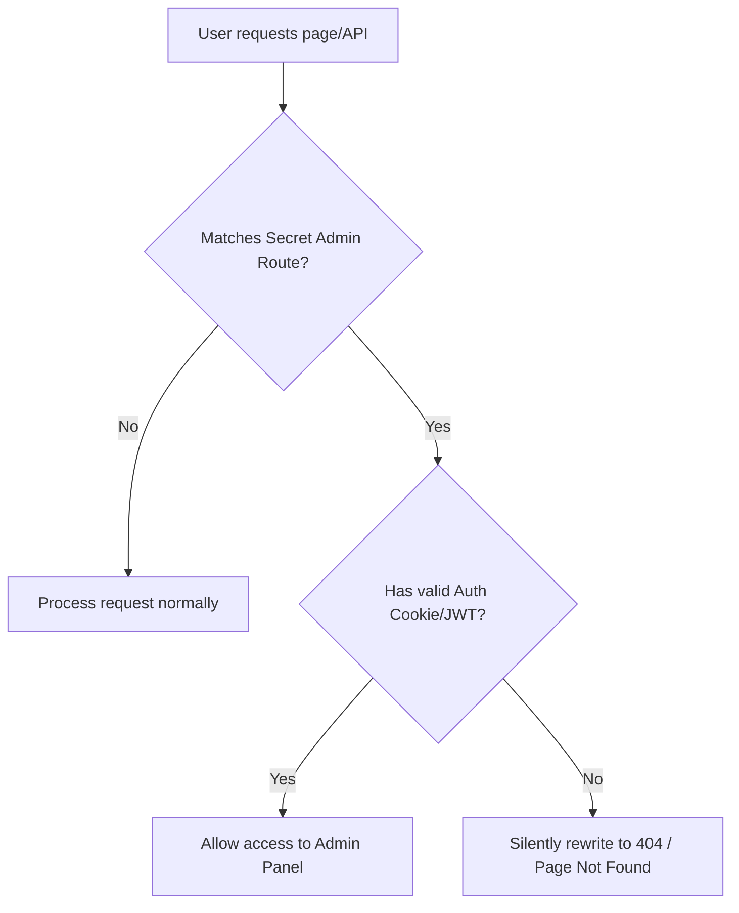

# Admin Dashboard Implementation Plan (Firebase)

This document details the architectural plan for implementing the **Admin Dashboard** in the Wendev Portfolio. The primary requirement is that **only the owner (Frouen Medina Jr.) should be able to access the admin/login portal**, with zero public entry points, links, or easily discoverable URLs.

---

## 🛡️ Security Architecture: Hidden Gatekeeping

To prevent unauthorized discovery and access, we will use a combination of **Security through Obscurity** (hidden custom path) and **Strict Route Guarding** (Next.js Middleware + Firebase Admin Session verification).

### 1. Custom URL Mapping (Dynamic Obscurity)
Instead of standard routes like `/admin`, `/login`, or `/dashboard`, the admin route will be configured via an environment variable.

* **Development Config (`.env.local`)**:
  ```ini
  # The secret URL required to access the admin entry page
  ADMIN_LOGIN_ROUTE=wendev-portal-secure-9912
  ```
* **Routing Logic**:
  * Visiting `wendev.life/wendev-portal-secure-9912` loads the login screen.
  * Visiting standard entry points like `/admin`, `/login`, or `/portal` returns a **404 Not Found** or redirects to the homepage `/`.

### 2. Next.js Middleware Guarding (`middleware.ts`)
We will enforce route protection at the edge before any Next.js page renders. 



---

## 🔑 Authentication Architecture

Since Frouen is the **sole administrator**, we do not need complex multi-user registration flows. We will use Firebase Authentication integrated with Next.js Middleware:

### Firebase Auth Integration
1. **Firebase Client SDK**: Admin logs in on the secret login page using email and password via Firebase Auth client SDK.
2. **Session Cookie**: Upon successful sign-in, the client sends the ID token to a backend endpoint (e.g., `/api/auth/session`), which validates it with the **Firebase Admin SDK** and generates an HTTP-only, secure Session Cookie (`__session`).
3. **Middleware Guard**: Next.js Middleware intercepts dashboard requests, reads the `__session` cookie, and verifies it against the Firebase Admin SDK.
4. **Email Restriction**: Ensure only your specific Gmail account is authorized:
   ```typescript
   if (decodedToken.email !== process.env.ADMIN_EMAIL) {
       // Destroy session and reject access
   }
   ```

---

## 🗄️ Database & Dynamic API Design (Firebase Cloud Firestore)

Currently, portfolio projects are statically defined in `components/sections/Projects.tsx`. We will migrate them to **Firebase Cloud Firestore** collections so they can be managed dynamically.

### 1. Firestore Schema & Collections

#### `projects` Collection
Documents contain:
* `name` (string) - Name of the project (e.g., "SudoTech+")
* `description` (string) - Brief overview
* `tags` (array of strings) - e.g., `["React", "Node.js"]`
* `url` (string) - Project link
* `domain` (string) - Display domain (e.g., "sudotech.plus")
* `image` (string) - Path to project image (stored in Firebase Storage or public directory)
* `createdAt` (timestamp) - Creation date for sorting

#### `reviews` Collection
Documents contain:
* `reviewerName` (string) - Client's name
* `company` (string) - Client's company/org (optional)
* `rating` (number) - Value from `1` to `5`
* `content` (string) - Review text
* `isApproved` (boolean) - Approval flag (default: `false`)
* `createdAt` (timestamp) - Submission date

### 2. Next.js API Routes Layout

| Endpoint | Method | Public / Private | Firebase SDK Operation |
| :--- | :--- | :--- | :--- |
| `/api/projects` | `GET` | Public | Fetches all documents from `projects` ordered by `createdAt` |
| `/api/projects` | `POST` | Private (Admin) | Adds a document to the `projects` collection |
| `/api/projects/[id]` | `PUT` | Private (Admin) | Updates project document fields matching the ID |
| `/api/projects/[id]` | `DELETE` | Private (Admin) | Deletes a project document from Firestore |
| `/api/reviews` | `GET` | Public | Fetches documents from `reviews` where `isApproved == true` |
| `/api/reviews` | `POST` | Public | Adds a new client review document (defaulting `isApproved: false`) |
| `/api/reviews/[id]` | `PUT` | Private (Admin) | Approves or rejects a review (toggling `isApproved`) |
| `/api/reviews/[id]` | `DELETE` | Private (Admin) | Deletes a review document from Firestore |

---

## 🛠️ Step-by-Step Implementation Plan

### Phase 1: Setup Firebase Admin SDK in API routes
1. Add Firebase Admin SDK dependency: `npm install firebase-admin`.
2. Configure a Firebase Admin instance utility (`lib/firebase-admin.ts`) using credentials from environment variables (`FIREBASE_PROJECT_ID`, `FIREBASE_CLIENT_EMAIL`, `FIREBASE_PRIVATE_KEY`).
3. Setup dynamic fetches for `/api/projects` and `/api/reviews`.

### Phase 2: Create hidden auth structures & middleware
1. Write the Next.js `middleware.ts` file.
2. Intercept the custom path defined by `ADMIN_LOGIN_ROUTE` (e.g., `/wendev-portal-secure-9912`).
3. Validate session cookies using `firebase-admin` authentication checks. Rewrite unauthorized requests to `/404`.

### Phase 3: Build Admin Dashboard UI
1. Create the routes under `app/(admin)/admin-portal/page.tsx` (using Next.js route groups helps isolate styling layouts).
2. Design dashboard interfaces matching the portfolio's aesthetics:
   - **Dashboard Home**: Review queue and list of projects.
   - **Project Manager**: Add/edit project entries and tags.
   - **Review Moderator**: Easily toggle approval flags or delete reviews.
